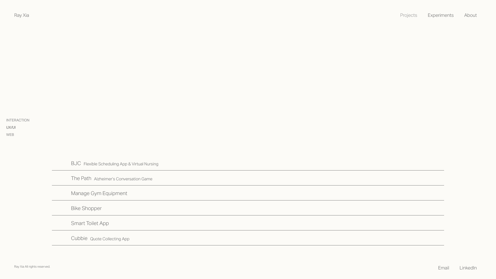

# **FP2 \- Evaluation of the Final project**

## Project Description

I am comparing two ideas. The first idea is the Text Dungeon, a web page with animated text that is not really meant to be read but to play around with.

The second idea is a personal portfolio as a showcase of my past projects.

## High-Fi Prototypes

### *Prototype 1*

Participants thought the text dungeon idea was creative but were confused about its functionality at first. They thought the scrolling action was intuitive, so were using the keyboard to navigate. 

### *Prototype 2*

Participants appreciated the clearness of the purpose of the website, although it was difficult for them to navigate around and read all the text.They thought it was cool how the image follows the mouse, but wish their sizes could change.

## Usability Test

In terms of understanding the functionality,
participants had a clearer understanding of the personal portfolio than the text dungeon after exploring both prototypes. This is mainly due to their previous exposures to similar portfolio websites, whereas they had rarely interacted with animated text before.

In terms of navigating the page, the scrolling action from the text dungeon idea felt more intuitive to the participants than the hovering action from the portfolio, as the latter require opening the accordion and moving the mouse around to read the text. Accidentally moving the cursor outside of the accordion will cause it to close, which brought frustration to one participant. They wish the images can get smaller in order for them to read the text easier.

In terms of turning animations or music off, while not functional in the prototype, participants correctly imagined where and how they would approach the task. They also appreciated this function when they wish to read the full story, as animation and sound can be distracting.

Based on the user feedback, it seemed like the the personal portfolio idea has greater potential as it is more functional and matches the usability guidelines. The text dungeon idea has cool animations but is less functional.

## Updated Designs

Instead of using accdions to contain information about the project, I changed them to a static button that displays key information at all time. The image will still follow the mouse when hovering over the button. Clicking the button will navigate to the detail page of the project.

## Feedback Summary

The lab session was helpful for me to determine which idea is more technically feasible. It seems that doing animation with GSAP require a lot of learning beforehand and the final output may not be as desireable as the design is. I am still willing to incorporate GSAP to my personal website to get more practice with it, such as using the library to enable more smooth transition or page navigation. However, the discussion helped me decide that the main focus of my idea should not be the animation happening by itself but more about how  interact with the website to trigger it.

## Milestones

Weekly milestones until the end of the semester. 

### *Implementation Plan*

- [X] Week 9 Oct 28 \- Nov 1:
  - [X] FP1 due
  
- [X] Week 10 Nov 4 \- Nov 8:   
  - [X] FP2 due
- [ ] Week 11 Nov 11 \- Nov 15: 
  - [ ] Image hovering function implementation
  - [ ] Button function implementation
- [ ] Week 12 Nov 18 \- Nov 22:  
  - [ ] Adding actual content to the button (text, images)
  - [ ] Detail page layout implementation 
- [ ] Week 13 Nov 25 \- Nov 29:  
  - [ ] Responsive design 
  - [ ] Thanksgiving  
- [ ] Week 14 Dec 2 \- Dec 6:  
  - [ ] FP4 due 

### *Libraries and Other Components*

Including but not limited to:

Astro (https://astro.build/)

Tailwind CSS (https://tailwindcss.com/)

## Generative AI Use Plan

Outline how you plan to use Generative AI tools to aid in the implementation (\~300 words).

### *Tool Use*

* ChatGPT  
  * I will use it for checking syntax and explaining why a specific bug happens because it can help me identify problems faster and earlier in the stage.
  * I will not use it for writing functions for me because it won't help me practice what I've learned in the class. 
  * I will also not let it decide the properties to apply to the page (such as color, alt text, content hierarchy) because it might not help me practice implementing usability heuristics.

### *Responsible Use*
I will add comment on the lines of code that are written or informed by ChatGPT, and I will give creadit to other external sources I use. In addition, I will go through any generated code and modify it if needed make sure it aligns with usability guidelines. 

---

# **FP1 \- Proposal for Critique**

## Idea Sketches

### *Idea 1*

* **What**: a web page with animated text that is not really meant to be read but to play around with
* **How**: GSAP animation library
* **Accessibility**: ensure all affordance are given upon page load and can be retrieved any time when the user asks for help
* **Information to convey**: breaking the preimposed functions of text

### *Idea 2*

* **What**: an interface that tracks body movements to trigger music
* **How**: different “buttons” on the screen that plays different rhythm or beats, option to record sound (camera + Tensorflow.js)
* **Accessibility**: include interactive tutorials and make sure buttons can be selected with keyboards
* **Information to convey**: breaking the physical barrier and make music by moving body around

### *Idea 3*

* **What**: a portfolio with documentations of my past projects
* **How**: astro framework that streamlines component-based content
* **Accessibility**: have semantic tags for screenreader; include buttons to adjust text size and contrast
* **Information to convey**: Showcase my creativity as well as professional works

## Feedback Summary

* The first idea seemed to be more popular because it was discussed for longer times. 
* Eunice, one of my peers, shared with me other websites she has seen with cool scrolling animations. 
* Another feedback I had on usability is to include optional alternative in addition to the primary scrolling action. For example, using arrow key to control the page to go smoothly up and down can be an alternative. 
* Marshall also thought this idea stood out for its creativity.
* Marshall shared his suggestion on affordance:
    > In many games, the first level acts as a well-crafted tutorial that teaches the player moves one by one before letting them progress to the actual levels. You might consider a similar approach.
* The second idea seemed interesting but less clear, and I took some time to explain how it will work.
* Although creative, Marshall thought that the integration with camera and motion might add complexity to usability:
    > As with the Text Dungeon example, it may be helpful to include some interactive tutorials to ease users into the experience.
One thing to keep in mind is the integration of machine learning. While it’s a cool idea, it’s not the primary learning objective of this course. I don’t discourage you from using it, but be mindful of the effort it may require, and ensure it doesn’t distract you from demonstrating your skills in usability, which is the main focus of this course.
* The third idea solicited good design practice from Marshall to test small snippets of code before implementation:
    >You may want to explore worked examples and their source code for the third-party libraries you're interested in but unsure about. This will help you assess which features are replicable and feasible for your project.

## Feedback Digestion

The feedback on usability will be all helpful regardless of which idea I move forward with. For example, scrolling can happen to both the text dungeon idea and the portfolio idea, so it would be beneficial to include key events whenever there is scrolling happening. I am also thinking about incorporating more keyboard functions, such as tab keys for jumping paragraphs, left/right arrow keys for triggering text animation, etc. 

I like the idea of including tutorials to introduce any unfamiliar affordances. As it could be a lot of information to digest at once for first-time users, I want to keep that information retrievable whenever users want to refer to it. For example, it could be a side toggle that can be collapsed by default, and can be triggered by clicking or certain keys to expand and show instructions. An alternative to this is to break the tutorial down into different levels, as users approach from one stage to the next. This alternative might be better applied to the sing and dance idea as opposed to the text dungeon idea, however, as the reading experience of the latter can be interrupted easily with frequent pop ups of tutorials.

I am also down to explore the libraries I'll be using and see what others have done with the library. This will be helpful for me to consider what is possible within the given timeframe. While I'm not set on the final idea, I think exploring the libraries can help me with the decision.

To summarize, the three major feedback I'll keep in mind are:
* include keyboard alternatives to scroll, drag, or click events
* include tutorial to provide affordances
* explore communities of third-party libraries to see what others have done
